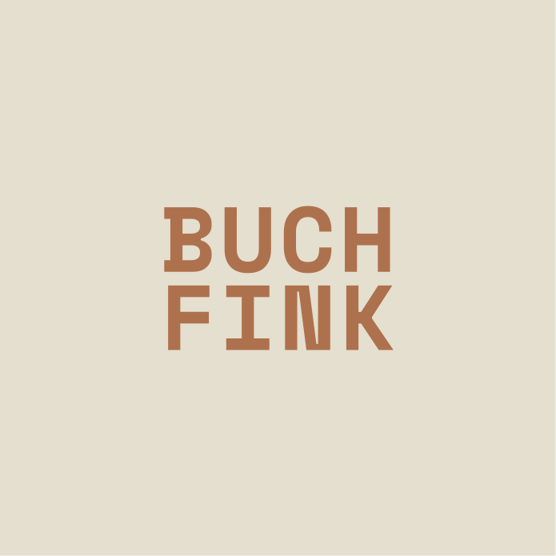
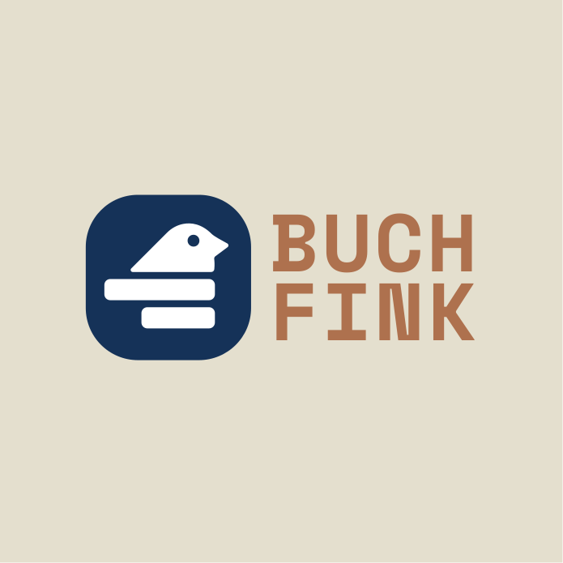

# Buchfink CI

Brand identity guidelines for Buchfink.

## Logo

| | | |
|---|---|---|
|  |  |  |

## Typography

- **Headlines:** Space Mono
- **Body:** Rethink Sans (Regular / Medium / Bold)

## Color Palette

## Wordmark

| Orange | Blue | Green |
|---|---|---|
|  |  |  |

## Application

| | |
|---|---|
|  |  |

## Assets

SVG icons and wordmarks available in [`SVG/`](SVG/).
